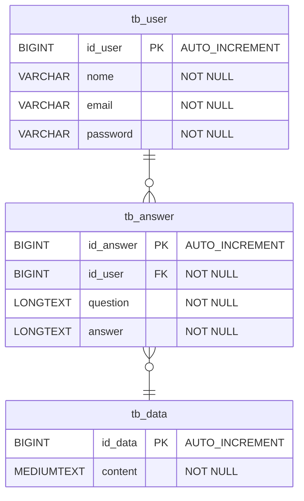

# **AI PROMPTER**

> Um projeto de Inteligência Artificial usando Langchain4j para processamento de linguagem natural.

## **Índice**
- [Visão Geral](#visão-geral)
- [Funcionalidades](#funcionalidades)

## **Visão Geral**
Este projeto é uma aplicação de 
Inteligência Artificial que utiliza o 
Langchain4j, uma biblioteca poderosa para a 
criação de modelos de linguagem natural em Java. 
O objetivo deste projeto é 
criar uma API que utiliza de um modelo de processamento de linguagem natural para responder a questões
ou fornecer informações baseadas em uma base de dados interna.

## **Funcionalidades**
- **Processamento de Linguagem Natural:** Utiliza o Langchain4j para interpretar e gerar texto.
- **Respostas Dinâmicas:** Responde a perguntas com base em dados fornecidos e treinados.
- **Integração Fácil:** Pode ser facilmente integrado com outras aplicações Java.

## **Diagramas**
